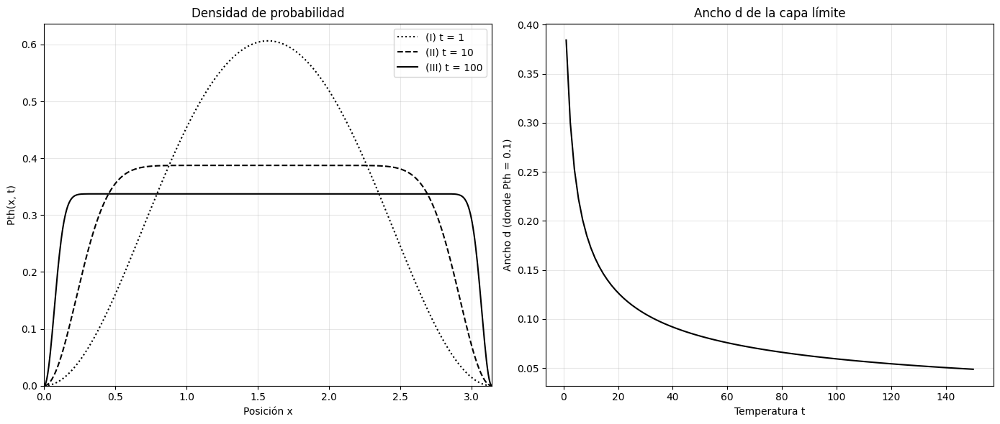
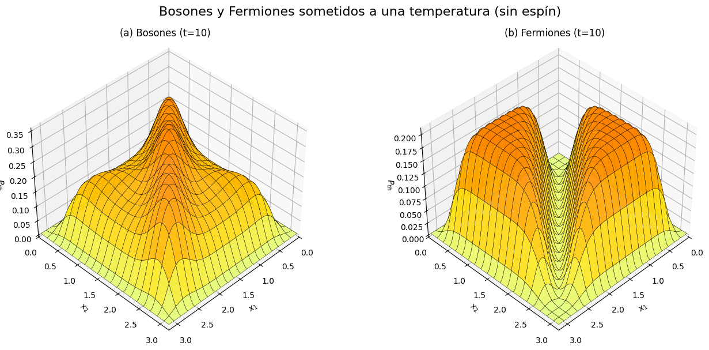
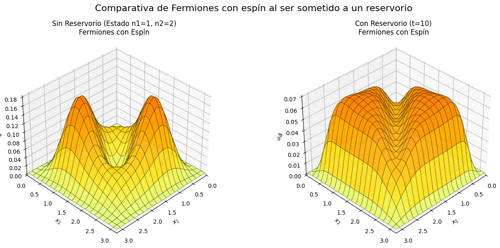
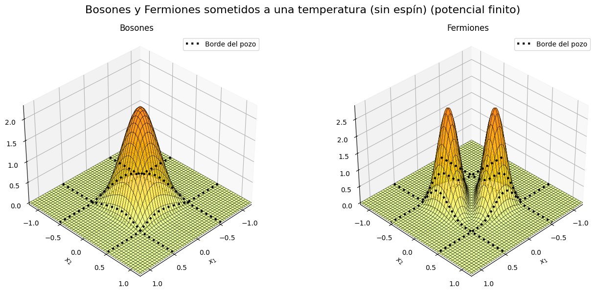
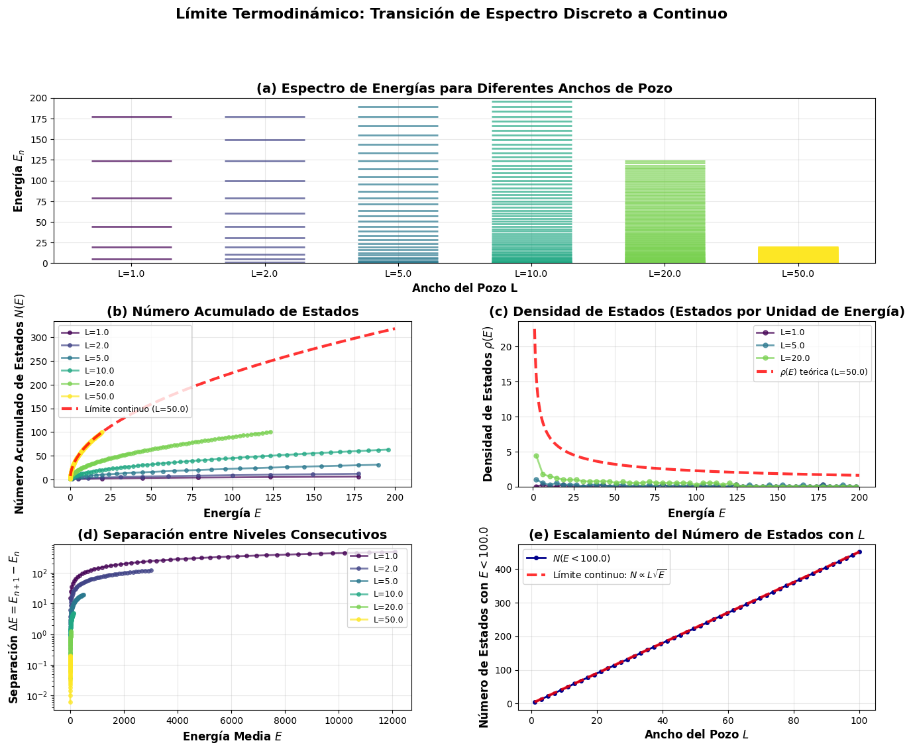
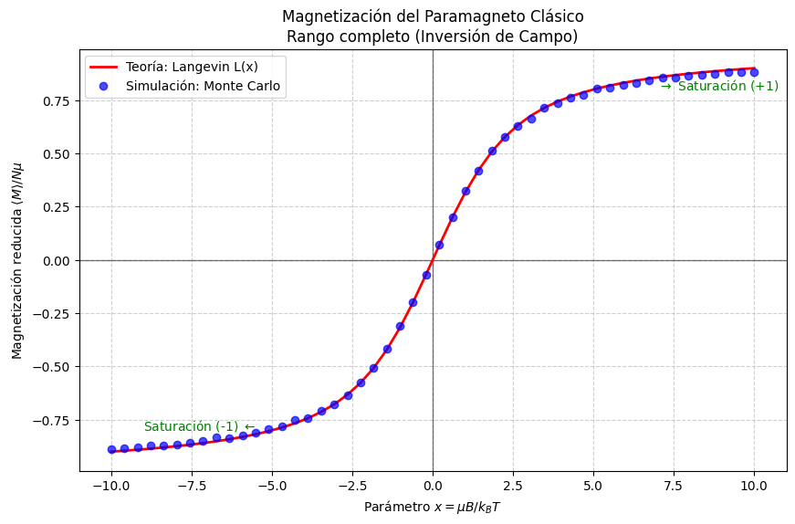

# Where Are the Particles When the Box Is Hot?

**Thermal distributions and quantum statistics of confined particles**

[](https://www.python.org/)
[](LICENSE)
[](#theoretical-framework)

---

## Overview

This repository presents a numerical and theoretical investigation into the spatial probability density distribution $P(x)$ of 1D quantum systems confined in potential wells and coupled to a thermal reservoir at finite temperature $T$.

The project examines how spatial distributions evolve under the combined influence of:
* Thermal excitation ($k_B T$).
* Quantum statistics (Bose-Einstein vs. Fermi-Dirac).
* Particle indistinguishability.
* Spin degrees of freedom ($s = 1/2$).
* Boundary conditions (Infinite Square Well vs. Finite Potential Well).
* Box size scaling ($L \to \infty$) and the classical thermodynamic limit.

Additionally, a complementary module simulates a classical $N$-dipole paramagnet using the Metropolis Monte Carlo method to evaluate classical thermal equilibrium and compare against the Langevin function.

---

## Physical Problem

In standard introductory quantum mechanics, single-particle energy eigenstates $\phi_n(x)$ in a 1D box exhibit spatial node patterns dependent purely on quantum numbers $n$. However, real physical systems (such as electrons or excitons trapped in quantum dots or optical lattices) interact with external thermal environments.

When a quantum system is in thermal contact with a heat bath at temperature $T$, pure states $\phi_n(x)$ transform into a statistical mixture described by the canonical ensemble. The key physical questions addressed here are:
1. How does thermal energy redistribute particle positions inside a box?
2. How do exchange symmetry (bosons vs. fermions) and spin alter two-particle spatial correlations under thermal fluctuations?
3. What happens when potential walls are finite, allowing quantum tunneling and decay into classically forbidden regions?
4. How does the discrete energy spectrum transition to the continuous classical density of states $\rho(E)$ in the thermodynamic limit $L \to \infty$?

---

## Theoretical Framework

### One Particle in an Infinite Square Well

For a particle of mass $m$ confined in an infinite potential box $x \in [0, L]$, the spatial wavefunctions and energy eigenvalues are:

$$
\phi_n(x) = \sqrt{\frac{2}{L}} \sin\left(\frac{n\pi x}{L}\right), \qquad n = 1, 2, 3, \dots
$$

$$
E_n = \frac{n^2 \pi^2 \hbar^2}{2mL^2}
$$

Coupling the system to a thermal reservoir introduces the Boltzmann factor $e^{-\beta E_n}$ (where $\beta = 1 / k_B T$). The canonical thermal probability density $P_{\mathrm{th}}(x)$ is:

$$
P_{\mathrm{th}}(x) = \frac{\sum_{n=1}^{N_{\mathrm{max}}} e^{-\beta E_n} |\phi_n(x)|^2}{\sum_{n=1}^{N_{\mathrm{max}}} e^{-\beta E_n}}
$$

At low temperatures ($T \to 0$), the distribution collapses to the ground state $|\phi_1(x)|^2$. As $T$ increases, higher excited states populate, smoothing out spatial oscillations and driving $P_{\mathrm{th}}(x)$ toward a uniform distribution across the box.

---

### Two Indistinguishable Particles

For two identical non-interacting particles in a 1D box, quantum mechanics dictates that the total spatial wavefunction must reflect exchange symmetry:

* **Bosons (Symmetric spatial wavefunction):**
  $$
  \Psi_b^{n_1, n_2}(x_1, x_2) = \frac{1}{\sqrt{2 (1 + \delta_{n_1, n_2})}} \left[ \phi_{n_1}(x_1) \phi_{n_2}(x_2) + \phi_{n_1}(x_2) \phi_{n_2}(x_1) \right]
  $$

* **Fermions (Antisymmetric spatial wavefunction, $n_1 \neq n_2$):**
  $$
  \Psi_f^{n_1, n_2}(x_1, x_2) = \frac{1}{\sqrt{2}} \left[ \phi_{n_1}(x_1) \phi_{n_2}(x_2) - \phi_{n_1}(x_2) \phi_{n_1}(x_1) \right]
  $$

The joint thermal probability density $P_{\mathrm{th}}(x_1, x_2)$ is obtained by weighting joint states $|\Psi_{b/f}^{n_1, n_2}(x_1, x_2)|^2$ with the two-particle Boltzmann factor $e^{-\beta (E_{n_1} + E_{n_2})}$.

---

### Spin-1/2 Fermions

For spin-1/2 fermions (such as electrons), Pauli's exclusion principle requires the *total* state (space $\otimes$ spin) to be antisymmetric. This yields two spin configurations:

1. **Spin Singlet ($S=0$, antisymmetric spin state):** Requires a **symmetric** spatial state $\Psi_{\mathrm{sym}}(x_1, x_2)$ (statistical weight 1/4).
2. **Spin Triplet ($S=1$, symmetric spin state):** Requires an **antisymmetric** spatial state $\Psi_{\mathrm{anti}}(x_1, x_2)$ (statistical weight 3/4).

The total spatial probability density combining both spin channels is:

$$
P_{\mathrm{spin}}(x_1, x_2) = \frac{1}{4} |\Psi_{\mathrm{sym}}(x_1, x_2)|^2 + \frac{3}{4} |\Psi_{\mathrm{anti}}(x_1, x_2)|^2
$$

The singlet component allows electrons with opposite spins to occupy identical spatial positions ($x_1 = x_2$), lifting the strict spatial zero node found in spinless fermions.

---

### Finite Potential Well

When the potential height is finite ($V(x) = 0$ for $|x| < L/2$, and $V(x) = V_0$ for $|x| > L/2$), wavefunctions penetrate the potential walls. Bound states ($E < V_0$) are solved by matching boundary conditions across regions, leading to transcendental equations in terms of $z = \frac{k L}{2}$ and $z_0 = \frac{L}{2\hbar} \sqrt{2m V_0}$:

* **Even (Symmetric) States:** $\tan(z) = \sqrt{\left(\frac{z_0}{z}\right)^2 - 1}$
* **Odd (Antisymmetric) States:** $-\cot(z) = \sqrt{\left(\frac{z_0}{z}\right)^2 - 1}$

Allowed energy levels $E_n$ are solved numerically. Spatial wavefunctions extend beyond $|x| = L/2$ with exponential decay, resulting in finite probability tails in classically forbidden regions.

---

### Thermodynamic Limit

As the width of the box $L \to \infty$, the discrete energy spacing $\Delta E = E_{n+1} - E_n \propto 1/L^2$ decreases continuously. In this limit, the discrete spectrum transitions into a continuous classical density of states $\rho(E)$:

$$
\rho(E) = \frac{dN}{dE} = \frac{L}{\pi\hbar} \sqrt{\frac{2m}{E}}
$$

---

## Computational Methods

The numerical calculations and visualizations are implemented in Python using `numpy`, `scipy`, and `matplotlib`:

1. **Transcendental Root Finding:** Bound state energies $E_n$ for finite wells are accurately determined using Brent's method (`scipy.optimize.brentq`) within valid bracket subintervals.
2. **Numerical Normalization:** Wavefunction constants $A$ and $B$ across piecewise regions in finite wells are normalized via numerical integration (`scipy.integrate.simps` / `quad`).
3. **Thermal Sum Convergence:** Thermal probability sums are truncated dynamically at $N_{\mathrm{max}} \approx 15\text{--}20$, which is verified to yield machine-precision convergence for the evaluated temperatures.
4. **Metropolis Monte Carlo:** The classical Heisenberg paramagnet is simulated by uniform angle sampling $u = \cos\theta \in [-1, 1]$ and applying the Metropolis acceptance criterion $A = \min(1, e^{-\beta \Delta E})$.

---

## Results & Key Visualizations

### 1. Evolution of Thermal Distribution with Temperature
As temperature $T$ increases, thermal energy populates higher energy modes. The spatial probability density $P_{\mathrm{th}}(x)$ transitions from the ground-state $\sin^2(\pi x / L)$ profile to an increasingly uniform distribution bounded by the box walls.



---

### 2. Boson vs. Fermion Spatial Correlations
Joint spatial probability maps $P(x_1, x_2)$ highlight fundamental exchange statistics:
* **Fermiones (without spin):** Spatial anti-bunching produces a zero-probability node along the diagonal $x_1 = x_2$.
* **Bosons:** Spatial bunching enhances joint probability around identical coordinates.



---

### 3. Spin-1/2 Effects on Spatial Distribution
Including spin degrees of freedom averages singlet (1/4) and triplet (3/4) configurations. The singlet contribution restores non-zero spatial probability at $x_1 = x_2$, relaxing the pure spatial exchange repulsion.



---

### 4. Barrier Penetration in Finite Wells
Unlike the infinite well, the finite potential well allows quantum wavefunctions to leak past $|x| = L/2$. Thermal excitation further broadens these exponential probability tails.



---

### 5. Thermodynamic Limit Analysis
Analysis of energy spectra as box width $L$ scales from $1.0$ to $50.0$: level spacing $\Delta E$ vanishes as $1/L^2$, energy levels compress, and the density of states converges toward the theoretical continuous curve $\rho(E) \propto L / \sqrt{E}$.



---

### 6. Classical Paramagnetism: Monte Carlo vs. Langevin
In the classical Heisenberg simulation, Metropolis Monte Carlo sampling of $N = 500$ magnetic dipoles perfectly reproduces the analytical Langevin function $\mathcal{L}(x) = \coth(x) - 1/x$ across magnetic parameter ranges $x = \mu B / k_B T \in [-10, 10]$.



---

## Repository Structure

```text
where_are_the_particles_when_the_box_is_hot/
├── README.md                                    # Main documentation
├── .gitignore                                   # Version control exclusions
├── requirements.txt                             # Python dependencies
├── docs/                                        # Research articles and presentations
│   ├── article_jose_ortiz.pdf                   # Full research paper (PDF)
│   ├── presentation_jose_ortiz.pdf              # Project slides presentation (PDF)
│   └── project_guide.pdf                        # Initial assignment guide (PDF)
├── notebooks/                                   # Executable Jupyter notebooks
│   ├── 01_quantum_particles_in_box.ipynb        # Main quantum statistical project
│   └── 02_heisenberg_classical_paramagnet.ipynb  # Complementary classical Monte Carlo study
└── figures/                                     # Exported PNG figures for documentation
    ├── thermal_distribution.png
    ├── boson_fermion_comparison.png
    ├── spin_effect.png
    ├── finite_well_penetration.png
    ├── thermodynamic_limit.png
    └── langevin_monte_carlo.png
```

---

## Requirements

The project relies on standard Python scientific packages:

* `python >= 3.8`
* `numpy`
* `scipy`
* `matplotlib`

All required packages are specified in [`requirements.txt`](requirements.txt).

---

## Running the Notebooks

1. Clone the repository:
   ```bash
   git clone https://github.com/dassjoss/where_are_the_particles_when_the_box_is_hot.git
   cd where_are_the_particles_when_the_box_is_hot
   ```

2. Create and activate a virtual environment (optional but recommended):
   ```bash
   python -m venv .venv
   source .venv/bin/activate  # On Windows: .venv\Scripts\activate
   ```

3. Install requirements:
   ```bash
   pip install -r requirements.txt
   ```

4. Launch Jupyter Lab or VS Code Notebooks:
   ```bash
   jupyter lab
   ```

5. Open and run the notebooks in the `notebooks/` directory:
   * **Main Project:** [`notebooks/01_quantum_particles_in_box.ipynb`](notebooks/01_quantum_particles_in_box.ipynb)
   * **Complementary Study:** [`notebooks/02_heisenberg_classical_paramagnet.ipynb`](notebooks/02_heisenberg_classical_paramagnet.ipynb)

---

## Documentation

Full theoretical developments, mathematical derivations, and academic presentations are available in the [`docs/`](docs/) directory:

* 📄 **[Research Article](docs/article_jose_ortiz.pdf)**: *Where are the particles when the box is hot?*, Jose David Ortíz Campo, Instituto de Física, Universidad de Antioquia.
* 📊 **[Presentation Slides](docs/presentation_jose_ortiz.pdf)**: Oral presentation slides detailing key figures and physical conclusions.
* 📝 **[Project Guide](docs/project_guide.pdf)**: Initial problem statement and guidelines.

---

## References

1. Schrödinger, E. (1926). *Quantisierung als Eigenwertproblem (vierte Mitteilung)*. Annalen der Physik, 386(18), 109–139.
2. Belloni, M., & Robinett, R. W. (2014). *The infinite well and Dirac delta function potentials as pedagogical, mathematical and physical models in quantum mechanics*. Physics Reports, 540(2), 25–122.
3. Reimann, S. M., & Manninen, M. (2002). *Electronic structure of quantum dots*. Reviews of Modern Physics, 74(4), 1283–1342.
4. Kouwenhoven, L. P., et al. (1997). *Electron transport in quantum dots*. NATO ASI Series E: Applied Sciences, 345, 105–214.
5. Hanson, R., et al. (2007). *Spins in few-electron quantum dots*. Reviews of Modern Physics, 79(4), 1217–1265.
6. Pathria, R. K., & Beale, P. D. (2011). *Statistical Mechanics* (3rd ed.). Elsevier.

---

## Author

**Jose David Ortíz Campo**  
Universidad de Antioquia — Instituto de Física  
Email: `jose.ortizc@udea.edu.co`  
GitHub Repository: [https://github.com/dassjoss/where_are_the_particles_when_the_box_is_hot](https://github.com/dassjoss/where_are_the_particles_when_the_box_is_hot)
